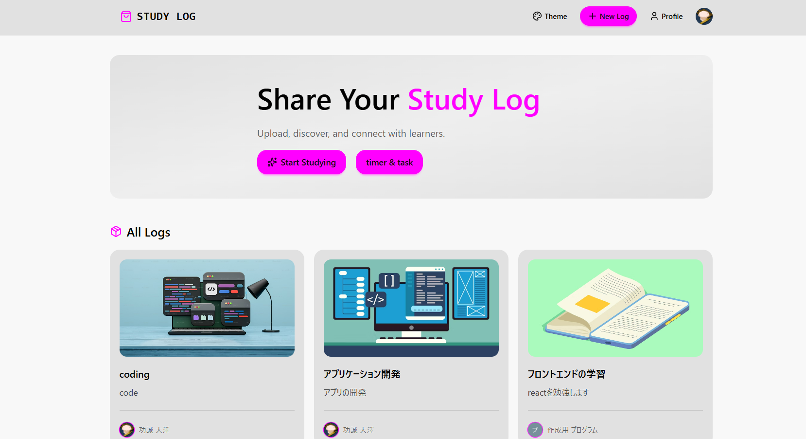
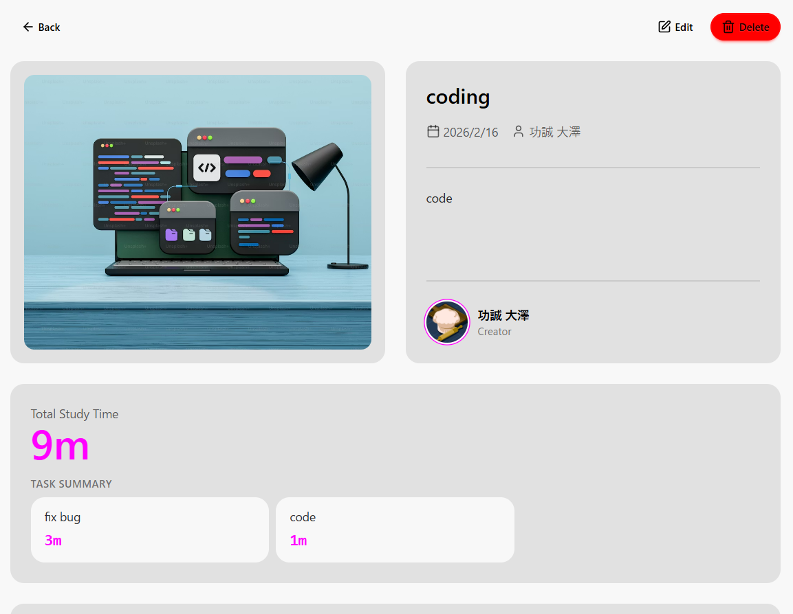
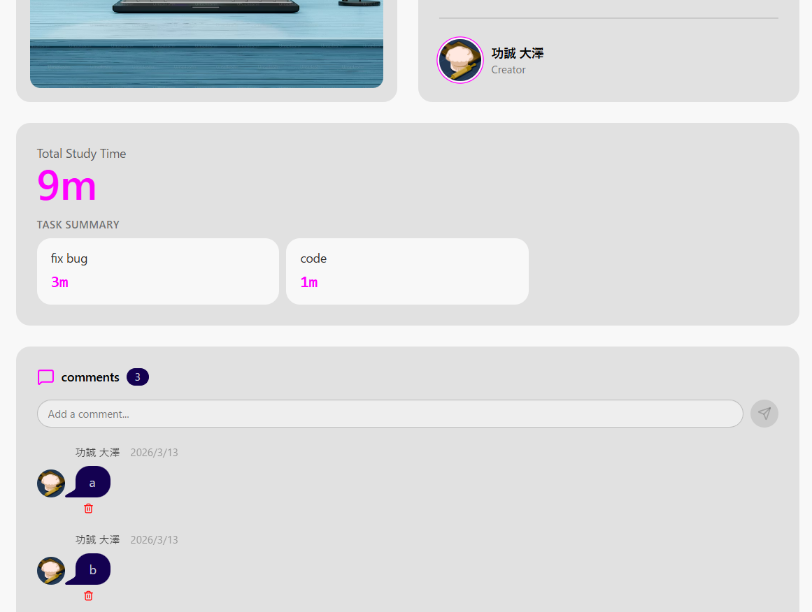
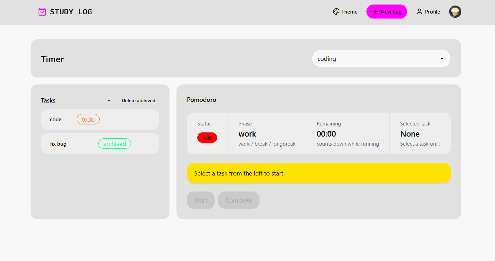
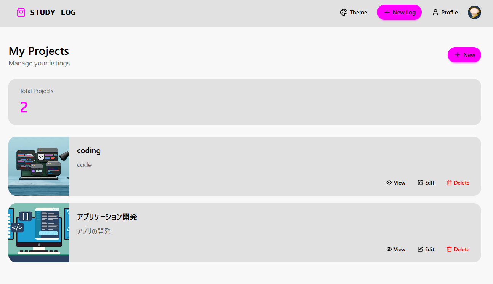
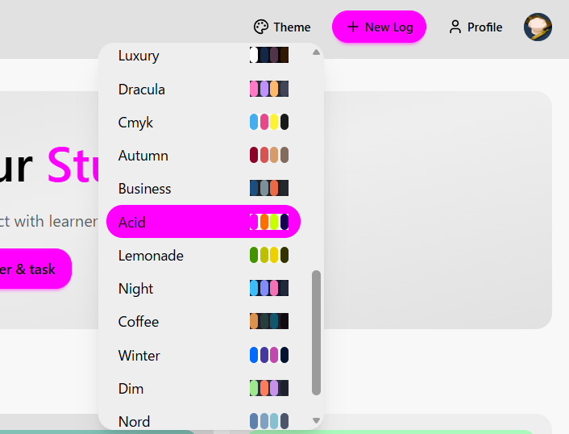
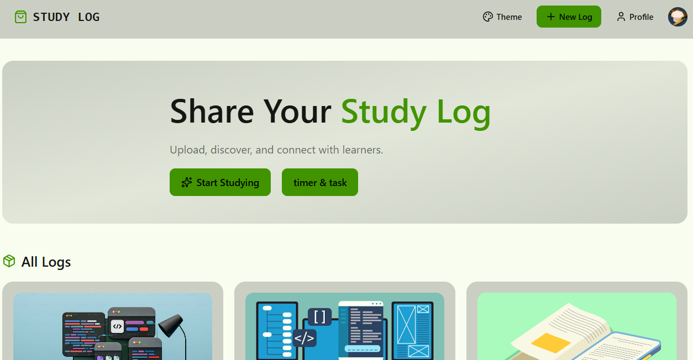

# Study Log － 自作アプリ概要資料

🔗 **デモ:** https://product-store-4gah.onrender.com
🐙 **GitHub:** https://github.com/kkkosei/study-log

---

## ① アプリ概要

**Study Log** は、塾講師として生徒の課題を解決するために開発した学習支援Webアプリです。
学習内容・学習時間・進捗を管理でき、分野とタスク単位で学習内容を記録し、ポモドーロタイマーによって勉強時間を蓄積できる設計としています。また、記録した内容は振り返りや改善に活用でき、コメント機能を通じて生徒同士や講師との対話も可能です。

| | |
|--|--|
| **想定ユーザー** | 塾の生徒 |
| **解決すること** | 「勉強が続かない」「勉強時間がない」という悩みを、学習計画管理とタイマーによって解消する |
| **権限制御** | 進捗や学習時間は本人のみが確認できる設計。生徒が監視されていると感じないよう配慮 |

---

## ② 背景・課題

塾講師として働く中で、「勉強を継続することがきつい」「忙しくて勉強時間がない」と悩む生徒を多く見てきました。そこで生徒と話し合ったところ、学習計画の管理やタイマーを用いた勉強ができる環境が欲しいという意見をもらい開発することに決めました。

ただ使ってもらうだけではなく、生徒が何度も使いたいと思わせるように技術選定から真剣に取り組みました。

---

## ③ 主な機能一覧

| 機能 | 説明 |
|------|------|
| ユーザー登録 / ログイン | Clerkによる認証。メール・Googleアカウントでログイン可能 |
| プロジェクト作成 / 編集 / 削除 | 科目や学習テーマをプロジェクトとして管理。未ログインでも閲覧可 |
| タスク追加 / アーカイブ / 削除 | プロジェクト内にTODOを作成。完了後はアーカイブで管理 |
| ポモドーロタイマー | 作業25分→休憩5分サイクル。タスクに紐づけてタイマーを動かすと学習時間を自動記録 |
| 学習時間の自動記録・集計 | タイマー完了時に記録。プロジェクト・タスク別の累計時間を表示 |
| コメント機能 | プロジェクトへのコメント投稿・閲覧 |
| テーマ切り替え | UIのカラーテーマを変更できる |

---

## ④ 画面説明

| 画面 | できること |
|------|-----------|
| **ホーム** | 全プロジェクトを一覧表示。未ログインでも閲覧可能 |
| **プロジェクト詳細** | タスク一覧・学習時間のサマリー・コメントを表示 |
| **タイマー** | プロジェクト・タスクを選択してポモドーロタイマーを起動。学習時間が自動で記録される |
| **プロジェクト作成 / 編集** | タイトル・説明・画像を設定してプロジェクトを作成・編集 |
| **プロフィール** | 自分のプロジェクト一覧を表示 |









---

## ⑤ 使用技術

| カテゴリ | 技術 |
|---------|------|
| **Frontend** | React, Vite, Tailwind CSS, DaisyUI, TanStack React Query |
| **Backend** | Node.js, Express, TypeScript |
| **DB** | PostgreSQL, Drizzle ORM |
| **認証** | Clerk |
| **インフラ** | Render（ホスティング）, Neon（PostgreSQL） |

---

## ⑥ システム構成

ReactフロントエンドからAxiosでExpress APIにリクエストを送り、Drizzle ORM経由でPostgreSQLにデータを保存する構成です。
認証はClerkが管理し、すべてのAPIリクエストにJWTトークンを付与してサーバー側で検証しています。
TanStack Queryによるキャッシュ管理により、更新後も常に最新のデータがUIに反映されるようにしています。

```
ブラウザ（React）
    ↓ HTTP + JWT（Axios）
Express サーバー（Node.js + TypeScript）
    ↓ Drizzle ORM
PostgreSQL（Neon）
```

---

## ⑦ データ設計

### 主要テーブル

| テーブル | 役割 |
|---------|------|
| `users` | ユーザー情報（Clerkと連携） |
| `projects` | 学習プロジェクト |
| `tasks` | プロジェクト内のタスク |
| `timer_sessions` | 学習セッションの記録（関連エンティティ） |
| `comments` | プロジェクトへのコメント |
| `pomodoro_state` | ポモドーロの進行状態 |
| `pomodoro_settings` | ポモドーロのユーザー設定 |

### テーブルの関係

```
users
 ├── projects
 │    ├── tasks
 │    └── comments
 └── timer_sessions
      ├── project_id → projects
      └── task_id   → tasks（NULLable）
```

---

## ⑧ 工夫した点・困難と解決

### 技術選定
生徒に「また使いたい」と思わせることを起点に技術を選定しました。

- **Vite** — ビルドを最適化してページ読み込み速度を向上
- **Clerk** — 整ったログインUIで認証のストレスをなくす
- **DaisyUI** — UIの一貫性を保ち、直感的に使える画面を短期間で実装
- **React Query** — キャッシュ管理でスムーズな画面描画を実現
- **TypeScript** — 型安全性を確保し保守しやすい設計を維持

### DB設計の失敗と改善

データベース設計の知識が不足した状態で実装を進めた結果、タスクと学習時間を密結合させた構造になってしまいました。タスクを削除すると紐づく学習記録も一緒に削除され、実際には取り組んだ時間まで消えてしまう問題が発生しました。

「達人に学ぶDB設計」を読み、正規化・関連エンティティの考え方を学んだ上で、タイマーセッションを `timer_sessions` として独立したテーブルに切り出しました。これによりタスクが削除されても過去の学習記録が残り、プロジェクト単位での正確な集計が可能になりました。

```
【変更前】tasks.total_seconds にそのまま保存
  → タスク削除で時間も消える

【変更後】timer_sessions テーブルで独立管理
  → タスクが消えても記録は残る
```

この経験から、機能を実装する前にデータの関係やUIなどの要件定義を行う重要性を学びました。

---

## ⑨ 成果

生徒から「学習に取り組む姿勢を変えることができた」「アプリを開くことで自然と取り組めるようになった」という感想をもらえたことが一番の成果です。誰かのためにアプリを開発することの面白さに気づいた瞬間でもありました。

また、UIのプロトタイプを生徒に見てもらいながら改善を繰り返したことで、「動くものを作る」だけでなく「使ってもらって育てる」プロセスを経験できました。

---

## 今後の展望

- **テスト導入** — 既存機能を壊さず安全に機能追加できる仕組みを作る
- **CI/CD** — テストやデプロイを自動化し安全にリリースできる環境を整える
- **コンテナ化（Docker）** — 複数人での開発環境を統一する
- **クラウドDBの活用** — より本番を意識したDB運用・設計を経験する
